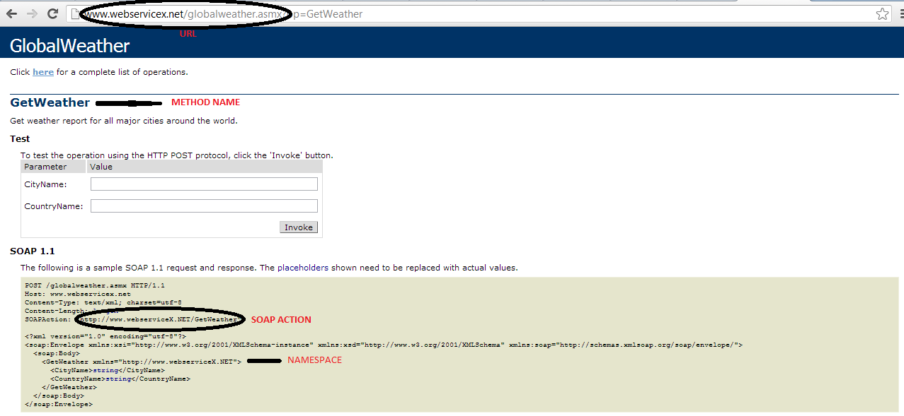

Android
=======

# Proyecto de Android: Clima Web Service

El presente proyecto consiste en una aplicacion que se conecte a un web service y nos muestre el clima de una ciudad en especifico.


Simplemente ingresamos el nombre del pais y la ciudad (en ingles, ya que el web service estaba en ingles) de los que queremos obtener el clima y damos click al boton "consultar"
Se nos muestra la ventana con el clima de la ciudad


##Codigo

Tenemos las siguientes clases
* ClimaProyectActivity: Es la activity principal que ingresa los nombres de pais y ciudad
* MostrarClimaActivity: Es la activity secundaria que muestra el clima
* ConeccionWS: Esta clase permite la coneccion al webservice
* ParserXML: Nos permite hacer parsing al codigo XML que nos devuelve el webservice
* Weather: La Clase que tiene los atributos del clima y sus metodos set y get


###ClimaProyectActivity
```java
public class ClimaProjectActivity extends Activity {
	private static final int REQUEST_TEXT = 0;
	private ProgressDialog pd;
	private EditText ciudad;
	private EditText pais;
	private Button boton1;
	private String res;
	private Weather clim = new Weather();
	
	private Context context;

	public void onCreate(Bundle savedInstanceState) {
		super.onCreate(savedInstanceState);
		context = this;
		setContentView(R.layout.activity_clima_project);
		ciudad = (EditText) findViewById(R.id.nombreCiudad);
		pais = (EditText) findViewById(R.id.nombrePais);
		boton1 = (Button) findViewById(R.id.botonOK);

		boton1.setOnClickListener(new OnClickListener() {

			@Override
			public void onClick(View arg0) {
				new TareaDescarga().execute("");
				pd = ProgressDialog.show(context, "Por favor espere","Consultando Clima", true, false);				
			}
		});
	}
	
	private class TareaDescarga extends AsyncTask<String, Void, Object> {
		protected Integer doInBackground(String... args) {
			ConeccionWS ws = new ConeccionWS();
			clim = ws.getClima(ciudad.getText().toString(), pais.getText()
					.toString());
			Intent i = new Intent(ClimaProjectActivity.this,MostrarClimaActivity.class);
			i.putExtra("Ciudad", clim.getLocation());
			i.putExtra("Temperatura", clim.getTemperature());
			i.putExtra("Humedad", clim.getRelativeHumidity());
			i.putExtra("Presion", clim.getPreassure());
			i.putExtra("Rocio", clim.getDewPoint());
			i.putExtra("Visibilidad", clim.getVisibility());
			i.putExtra("Viento", clim.getWind());
			i.putExtra("Cielo", clim.getSkyConditions());

			ClimaProjectActivity.this.startActivityForResult(i,REQUEST_TEXT);
			return 1;
		}

		protected void onPostExecute(Object result) {
			// Se elimina la pantalla de por favor espere.
			pd.dismiss();
			// Se muestra mensaje con la respuesta del servicio web
			Toast.makeText(context, "Clima: " + res, Toast.LENGTH_LONG).show();
			super.onPostExecute(result);
		}
	}
}

```
Aqui simplemente se leen los campos de los TextEdit: nombreCiudad y nombrePais y se las envia para la coneccion al web service.

Como particularidad se usa AsyncTast que nos permite correr tareas en background, aqui mostramos un progress dialog mientras se llama a la coneccion al web service en background, cuando se ha ejecutado la operacion se elimina el progress dialog y se lanza la seguna activity mediante un Intent, asi mismo a esta 2da activity se le pasan los parametros que nos devolvio el web service por medio de "putExtra"

Cuando se llama a:

```java
public void onClick(View arg0) {
	new TareaDescarga().execute("");
	pd = ProgressDialog.show(context, "Por favor espere","Consultando Clima", true, false);				
}
```
Se ejecuta la tarea en background y se muestra el progressDialog.

##ConeccionWS
En esta clase se realiza la coneccion a la web service, para ello tenemos que tener claro 4 datos de la web service

*NAMESPACE
*URL
*METHOD_NAME
*SOAP_ACTION

Estos se encuentran en la pagina del web service como se muestra a continuacion:

OJO: se hace uso de la libreria ksoap2 disponible [aqui](https://code.google.com/p/ksoap2-android/source/browse/m2-repo/com/google/code/ksoap2-android/ksoap2-android-assembly/3.0.0/ksoap2-android-assembly-3.0.0-jar-with-dependencies.jar)

```java
public class ConeccionWS {
	public Weather getClima(String ciudad,String pais) {
		String res=null;
		ParserXML par=new ParserXML();
		Weather clima = new Weather();
		
		String NAMESPACE = "http://www.webserviceX.NET";
		String URL="http://www.webservicex.net/globalweather.asmx";
		String METHOD_NAME = "GetWeather";
		String SOAP_ACTION = "http://www.webserviceX.NET/GetWeather";
		
		SoapObject rpc;
		rpc = new SoapObject(NAMESPACE, METHOD_NAME);
		//De acuerdo a la documentacion del ws, hay 2 parametros que debemos pasar nombre de la ciuda y del pais
		//Para obtener informacion del WS , se puede consultar http://www.webservicex.net/globalweather.asmx?WSDL
		rpc.addProperty("CityName", ciudad);
		rpc.addProperty("CountryName", pais);
		SoapSerializationEnvelope envelope = new SoapSerializationEnvelope(SoapEnvelope.VER11);
		envelope.bodyOut = rpc;
		
		envelope.dotNet = true;
		envelope.encodingStyle = SoapSerializationEnvelope.XSD;
		
		//Para acceder al WS se crea un objeto de tipo HttpTransportSE
		HttpTransportSE androidHttpTransport= null;
		try {
			
			androidHttpTransport = new HttpTransportSE(URL);
			androidHttpTransport.debug = true;
			//Llamado al servicio web . Son el nombre del SoapAction, que se encuentra en la documentacion del servicio web y el objeto envelope
			androidHttpTransport.call(SOAP_ACTION, envelope);
			//Respuesta del Servicio web
			
			res = envelope.getResponse().toString();
		}catch (Exception e){
			System.out.println(e.getMessage());
			Log.d("setlocation", e.getMessage());
		}
		try {
			//llamamos al parser del archivo XML
			clima=par.Parsear(res);
		} catch (XmlPullParserException e) {
			// TODO Auto-generated catch block
			e.printStackTrace();
		} catch (IOException e) {
			// TODO Auto-generated catch block
			e.printStackTrace();
		}
		
		return clima;
	}
}
```
Esta clase nos comunica con el web service pero nos entrega un archivo en XML dificil de leer de esta manera:
```xml
<string xmlns="http://www.webserviceX.NET">
<?xml version="1.0" encoding="utf-16"?> <CurrentWeather> <Location>Trujillo, Peru (SPRU) 08-06S 079-02W 30M</Location> <Time>May 20, 2013 - 05:00 AM EDT / 2013.05.20 0900 UTC</Time> <Wind> from the SSE (150 degrees) at 6 MPH (5 KT):0</Wind> <Visibility> 3 mile(s):0</Visibility> <SkyConditions> overcast</SkyConditions> <Temperature> 64 F (18 C)</Temperature> <DewPoint> 60 F (16 C)</DewPoint> <RelativeHumidity> 88%</RelativeHumidity> <Pressure> 29.88 in. Hg (1012 hPa)</Pressure> <Status>Success</Status> </CurrentWeather>
</string>
```
Por eso debemos pasarlo a un parser que nos desglose la informacion obtenida.

##ParserXML


```java
public class ParserXML {
	public Weather Parsear(String docXML) throws XmlPullParserException,
			IOException {

		Weather clima = new Weather();
		int i=1;
		
		XmlPullParserFactory factory = XmlPullParserFactory.newInstance();
		factory.setNamespaceAware(true);
		XmlPullParser xpp = factory.newPullParser();

		xpp.setInput(new StringReader(docXML));
		int eventType = xpp.getEventType();

		while (eventType != XmlPullParser.END_DOCUMENT) {
			if (eventType == XmlPullParser.START_DOCUMENT) {
				Log.d("setlocation", "Comienza Documento");
			} else if (eventType == XmlPullParser.START_TAG) {
				Log.d("setlocation", "Comienza tag" + xpp.getName());
			} else if (eventType == XmlPullParser.END_TAG) {
				Log.d("setlocation", "Termina tag" + xpp.getName());
			} else if (eventType == XmlPullParser.TEXT) {

				Log.d("setlocation", "Texto" + xpp.getText());
				Log.d("setlocation", ""+i+"");
				if(i%2==0){clima.setGeneral(xpp.getText());}
				i+=1;
			}
			eventType = xpp.next();
			
		}
		Log.d("setlocation", "Termina Documento");
		Log.d("setlocation", clima.toString());
		return clima;
	}
}
```


```java

```
##MostrarClimaActivity


```java

```


##Weather


```java

```

