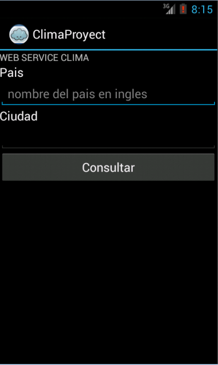
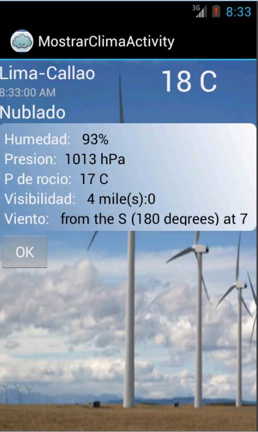

Android
=======

# Proyecto de Android: Clima Web Service

El presente proyecto consiste en una aplicacion que se conecte a un web service y nos muestre el clima de una ciudad en especifico.



Simplemente ingresamos el nombre del pais y la ciudad (en ingles, ya que el web service estaba en ingles) de los que queremos obtener el clima y damos click al boton "consultar"
Se nos muestra la ventana con el clima de la ciudad



##Codigo

Tenemos las siguientes clases
* ClimaProyectActivity: Es la activity principal que ingresa los nombres de pais y ciudad
* MostrarClimaActivity: Es la activity secundaria que muestra el clima
* ConeccionWS: Esta clase permite la coneccion al webservice
* ParserXML: Nos permite hacer parsing al codigo XML que nos devuelve el webservice
* Weather: La Clase que tiene los atributos del clima y sus metodos set y get


###ClimaProyectActivity
```java
public class ClimaProjectActivity extends Activity {
    private static final int REQUEST_TEXT = 0;
	private ProgressDialog pd;
	private TextView ciudad;
	private TextView pais;
	private Button boton1;
	private String res;
	private Weather clim = new Weather();
	
	private Context context;

	public void onCreate(Bundle savedInstanceState) {
		super.onCreate(savedInstanceState);
		context = this;
		setContentView(R.layout.activity_clima_project);
		ciudad = (TextView) findViewById(R.id.nombreCiudad);
		pais = (TextView) findViewById(R.id.nombrePais);
		boton1 = (Button) findViewById(R.id.botonOK);

		boton1.setOnClickListener(new OnClickListener() {

			@Override
			public void onClick(View arg0) {
				new DownloadTask2().execute("");
				pd = ProgressDialog.show(context, "Por favor espere","Consultando Clima", true, false);
			}

		});
	}
	
	private class DownloadTask2 extends AsyncTask<String, Void, Object> {
		protected Integer doInBackground(String... args) {
			ConeccionWS ws = new ConeccionWS();
			clim = ws.getClima(ciudad.getText().toString(), pais.getText()
					.toString());
			Intent i = new Intent(ClimaProjectActivity.this,MostrarClimaActivity.class);
			i.putExtra("Ciudad", clim.getLocation());
			i.putExtra("Temperatura", clim.getTemperature());
			i.putExtra("Humedad", clim.getRelativeHumidity());
			i.putExtra("Presion", clim.getPreassure());
			i.putExtra("Rocio", clim.getDewPoint());
			i.putExtra("Visibilidad", clim.getVisibility());
			i.putExtra("Viento", clim.getWind());
			i.putExtra("Cielo", clim.getSkyConditions());

			ClimaProjectActivity.this.startActivityForResult(i,REQUEST_TEXT);
			return 1;
		}

		protected void onPostExecute(Object result) {
			// Se elimina la pantalla de por favor espere.
			pd.dismiss();
			// Se muestra mensaje con la respuesta del servicio web
			Toast.makeText(context, "Clima: " + res, Toast.LENGTH_LONG).show();
			super.onPostExecute(result);
		}
	}

}
```


